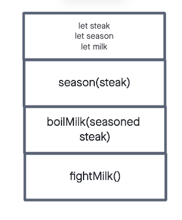

## Memory, all alone in the moonlight -
## What did I say about singing?
## Can I whistle?
## No
## Can I hum it?
## fine...
## Hmmm.Hmmm.Hmmm.Dun.Dun.Duuunnn
## (glares)
## (smiles back)

# In Memory Storage

## [Understanding the JavaScript Call Stack](https://www.freecodecamp.org/news/understanding-the-javascript-call-stack-861e41ae61d4/)
1. What is a ‘call’?
- A call is an function invocation. The execution of a function one at a time

2. How many ‘calls’ can happen at once?
- There is only one call that can happen at one time.

3. What does LIFO mean?
- Last-in-First-out: is how the call stack is built. The first thing called is the base and the things required to met the call are 'stacked' on top of it. Those things on the top need to be resolved or invoked before we can get back to the original call

4. Draw an example of a call stack and the functions that would need to be invoked to generate that call stack.

5. What causes a Stack Overflow?
- Stack Overflow is caused when you have no idea why your code is broken and you type the error code into google.
- Either that or when there is a recursive function that has been called therefore stacking infinite calls into the stack. To the point of overflow.

## [JavaScript Error Messages](https://codeburst.io/javascript-error-messages-debugging-d23f84f0ae7c)
1. What is a ‘refrence error’?
- This is trying to use a variable before it is declared

2. What is a ‘syntax error’?
- syntax is not valid to preform the call

3. What is a ‘range error’?
- when something that has an associated value that is either impossible or incorrect

4. What is a ‘tyep error’?
- I assume a type error(hehe). This is when the data type does not line up with the call that is being used: String.map() would be a type error

5. What is a breakpoint?
- It is a predetermined location to top the code from executing. Helpful if you have large cycles you are debugging

6. What does the word ‘debugger’ do in your code?
- Debugger shows the history up to that point

[Return Home](README.md)

